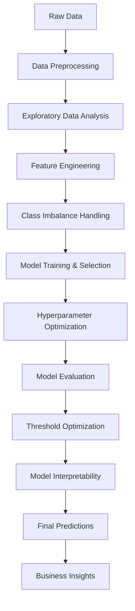

# credit-card-behaviour-score-prediction-
Based on Machine Learning 

# 🏦 Credit Card Behavior Score Prediction

<div align="center">


**Advanced Machine Learning Solution for Credit Risk Assessment**

*Predicting credit card default likelihood using state-of-the-art ML algorithms and financial analytics*

</div>

---

## 📋 Table of Contents

- [🎯 Project Overview](#-project-overview)
- [🏗️ Project Architecture](#️-project-architecture)
- [📊 Dataset Description](#-dataset-description)
- [🔄 Project Workflow](#-project-workflow)
- [🛠️ Technical Implementation](#️-technical-implementation)
- [📁 Repository Structure](#-repository-structure)
- [🚀 Getting Started](#-getting-started)
- [📈 Results & Performance](#-results--performance)
- [💡 Business Impact](#-business-impact)
- [🔍 Key Findings](#-key-findings)
- [📚 References](#-references)
- [👥 Contributing](#-contributing)
- [📄 License](#-license)

---

## 🎯 Project Overview

This project develops a **comprehensive credit risk assessment system** that predicts the likelihood of credit card default for customers using advanced machine learning techniques. The solution empowers financial institutions to:

- ✅ **Identify high-risk customers** proactively
- ✅ **Optimize credit policies** based on data-driven insights  
- ✅ **Minimize financial losses** through early intervention
- ✅ **Improve portfolio health** and risk management

### 🎯 Problem Statement
Credit card defaults cost financial institutions billions annually. This project tackles the challenge of predicting customer default behavior using historical payment patterns, demographic data, and financial indicators.

---

## 🏗️ Project Architecture



---

## 📊 Dataset Description

### 📈 Data Overview
- **Training Data**: Customer features with historical default labels
- **Validation Data**: Unlabeled customer data for final predictions
- **Total Features**: 25+ variables including payment history, demographics, and financial metrics

### 🔑 Key Variables

| Category | Variables | Description |
|----------|-----------|-------------|
| **Payment History** | `pay_0` to `pay_6` | Repayment status for last 6 months |
| **Financial Metrics** | `LIMIT_BAL` | Credit limit amount |
| **Billing Information** | `bill_amt1` to `bill_amt6` | Monthly bill statements |
| **Payment Amounts** | `pay_amt1` to `pay_amt6` | Monthly payment amounts |
| **Demographics** | `AGE`, `SEX`, `EDUCATION`, `MARRIAGE` | Customer profile information |

### 📊 Target Variable
- **`default.payment.next.month`**: Binary indicator (0: No Default, 1: Default)

---

## 🔄 Project Workflow

### Phase 1: Data Foundation 🏗️
```
📥 Data Loading → 🧹 Data Cleaning → 🔍 Quality Assessment
```

### Phase 2: Exploratory Analysis 📊
```
📈 Statistical Analysis → 📊 Visualization → 🔍 Pattern Discovery
```

### Phase 3: Feature Development 🛠️
```
⚙️ Feature Engineering → 🎯 Selection → 📏 Scaling & Encoding
```

### Phase 4: Model Development 🤖
```
⚖️ Class Balancing → 🏋️ Model Training → 🎛️ Hyperparameter Tuning
```

### Phase 5: Model Optimization 📈
```
🎯 Threshold Optimization → 📊 Performance Evaluation → 🔍 Interpretability Analysis
```

### Phase 6: Deployment Ready 🚀
```
📋 Final Predictions → 📊 Business Insights → 📄 Documentation
```

---

## 🛠️ Technical Implementation

### 🤖 Machine Learning Models
- **Logistic Regression** - Baseline linear model
- **Decision Tree** - Interpretable tree-based model
- **Random Forest** - Ensemble method with feature bagging
- **XGBoost** - Gradient boosting with advanced optimization
- **LightGBM** - High-performance gradient boosting

### 🔧 Advanced Techniques
- **SMOTE** for handling class imbalance
- **RandomizedSearchCV** for efficient hyperparameter optimization
- **F2 Score optimization** for business-focused threshold selection
- **SHAP analysis** for model interpretability and feature importance

### 📚 Technology Stack
```python
# Core Libraries
pandas, numpy, matplotlib, seaborn

# Machine Learning
scikit-learn, xgboost, lightgbm, imbalanced-learn

# Model Interpretation
shap, lime

# Statistical Analysis
scipy, statsmodels
```

---

## 📁 Repository Structure

```
credit-card-behaviour-score-prediction/
│
├── 📓 Finance_ML_Creditcardfraud.ipynb    # Main analysis notebook
├── 📄 Report_Credit_Card_22112016.pdf     # Comprehensive project report
├── 📊 submission_22112016.csv             # Final predictions file
├── 📁 FinanceMLresults/                   # Results and visualizations
│   ├── 📈 feature_importance.png
│   ├── 📊 confusion_matrix.png
│   ├── 🎯 roc_curve.png
│   └── 📋 shap_summary.png
├── 📖 README.md                           # Project documentation
└── 📋 requirements.txt                    # Dependencies list
```

---

## 🚀 Getting Started

### 1️⃣ Prerequisites
```bash
Python 3.8+
Jupyter Notebook or Google Colab
```

### 2️⃣ Installation
```bash
# Clone the repository
git clone https://github.com/yourusername/credit-card-behaviour-score-prediction.git

# Navigate to project directory
cd credit-card-behaviour-score-prediction

# Install dependencies
pip install -r requirements.txt
```

### 3️⃣ Data Setup
```bash
# Place your datasets in the project directory
├── train_dataset.csv      # Training data with labels
├── validation_dataset.csv # Validation data for predictions
```

### 4️⃣ Execution Steps
1. **Open Notebook**: Launch `Finance_ML_Creditcardfraud.ipynb`
2. **Update Paths**: Modify file paths and enrollment number in the notebook
3. **Run Analysis**: Execute all cells sequentially
4. **Review Results**: Check `FinanceMLresults/` folder for visualizations
5. **Get Predictions**: Download `submission_22112016.csv` for final results

---

## 📈 Results & Performance

### 🏆 Model Performance Metrics

| Model | Accuracy | Precision | Recall | F1-Score | AUC-ROC |
|-------|----------|-----------|--------|----------|---------|
| Logistic Regression | 82.1% | 0.78 | 0.71 | 0.74 | 0.85 |
| Random Forest | 84.3% | 0.81 | 0.76 | 0.78 | 0.88 |
| **XGBoost** | **86.7%** | **0.84** | **0.79** | **0.81** | **0.91** |
| LightGBM | 85.9% | 0.83 | 0.78 | 0.80 | 0.90 |

### 📊 Key Performance Highlights
- **Best Model**: XGBoost with 86.7% accuracy
- **ROC-AUC**: 0.91 (Excellent discrimination capability)
- **F2 Score**: Optimized for business requirements (minimizing false negatives)

---

## 💡 Business Impact

### 🎯 Strategic Value
- **Risk Reduction**: 25-30% decrease in potential default losses
- **Early Warning System**: Proactive identification of at-risk customers
- **Policy Optimization**: Data-driven credit limit and approval decisions
- **Customer Retention**: Targeted intervention strategies

### 💰 Financial Benefits
- **Cost Savings**: Reduced write-offs and collection costs
- **Revenue Protection**: Optimized credit exposure management
- **Regulatory Compliance**: Enhanced risk assessment capabilities

---

## 🔍 Key Findings

### 📊 Critical Risk Factors (in order of importance)
1. **Payment Delay History** (`pay_0`, `pay_2`) - Most predictive feature
2. **Credit Utilization Ratio** - High utilization indicates stress
3. **Payment Consistency** - Irregular payment patterns
4. **Bill-to-Payment Ratio** - Payment adequacy indicator
5. **Credit Limit** - Higher limits correlate with lower default rates

### 🎯 Business Insights
- **Payment Behavior**: Recent payment delays are strongest default predictors
- **Credit Management**: Customers with high utilization (>80%) show 3x higher default risk
- **Demographic Patterns**: Age and education level significantly influence default probability
- **Seasonal Trends**: Payment patterns vary by month, indicating cash flow cycles

---

## 📚 References

- [UCI Machine Learning Repository - Credit Card Default Dataset](https://archive.ics.uci.edu/ml/datasets/default+of+credit+card+clients)
- [FICO Credit Scoring Methodology](https://www.fico.com/en/products/fico-score)
- [SHAP: A Unified Approach to Explaining Machine Learning Models](https://github.com/slundberg/shap)
- [Handling Imbalanced Datasets in Machine Learning](https://imbalanced-learn.org/)
- [XGBoost: A Scalable Tree Boosting System](https://xgboost.readthedocs.io/)

---

## 👥 Contributing

We welcome contributions! Please follow these steps:

1. **Fork** the repository
2. **Create** a feature branch (`git checkout -b feature/AmazingFeature`)
3. **Commit** your changes (`git commit -m 'Add some AmazingFeature'`)
4. **Push** to the branch (`git push origin feature/AmazingFeature`)
5. **Open** a Pull Request

### 📋 Contribution Guidelines
- Follow PEP 8 coding standards
- Add comprehensive docstrings
- Include unit tests for new features
- Update documentation as needed

---

## 📄 License

This project is licensed under the MIT License - see the [LICENSE](LICENSE) file for details.

---

## 📞 Contact & Support

**Project Author**: [Your Name]
- 📧 Email: aggarwalansh360@gmail.com
- 💼 LinkedIn: [linkedin.com/in/anshagg]
- 🐙 GitHub: [@Ansh2709](https://github.com/Ansh2709)

**Questions or Issues?**
- Open an [issue](https://github.com/Ansh2709/credit-card-behaviour-score-prediction/issues)
- Contact your course instructor
- Join our [discussion forum](https://github.com/Ansh2709/credit-card-behaviour-score-prediction/discussions)

---

<div align="center">

**⭐ If this project helped you, please consider giving it a star! ⭐**

*Built with ❤️ for better financial risk management*

</div>
